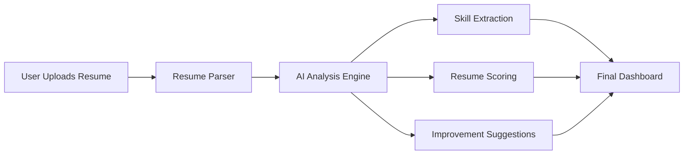

# 🚀 AI Resume Analyzer

<div align="center">


### ✨ Analyze resumes intelligently using AI

</div>

---

# 📌 Overview

AI Resume Analyzer is a smart web application that helps users improve their resumes using AI-powered analysis.

It analyzes uploaded resumes, extracts important information, identifies missing skills, and provides improvement suggestions for better job opportunities.

---

# 🎥 Interactive Preview

## 🌐 Live Workflow

```text
Resume Upload → AI Processing → Skill Extraction → Resume Score → Suggestions
```

---

# 🖥️ Project Visualizer



---

# ✨ Features

✅ Resume Upload System
✅ AI-Based Resume Analysis
✅ Resume Scoring
✅ Skill Extraction
✅ Smart Suggestions
✅ Interactive User Interface
✅ Fast Processing
✅ Responsive Design

---

# 🛠️ Tech Stack

| Frontend   | Backend    | AI         | Styling       |
| ---------- | ---------- | ---------- | ------------- |
| React.js   | Node.js    | OpenAI API | CSS           |
| HTML       | Express.js | NLP        | Tailwind      |
| JavaScript | MongoDB    | AI Models  | Responsive UI |

---

# 📂 Project Structure

```bash
AI-Resume-Analyzer/
│
├── client/
│   ├── components/
│   ├── pages/
│   ├── assets/
│   └── App.js
│
├── server/
│   ├── routes/
│   ├── controllers/
│   ├── models/
│   └── index.js
│
├── public/
├── package.json
└── README.md
```

---

# ⚙️ Installation Guide

## 1️⃣ Clone Repository

```bash
git clone https://github.com/charull44/AI-Resume-Analyzer.git
```

## 2️⃣ Open Project Folder

```bash
cd AI-Resume-Analyzer
```

## 3️⃣ Install Dependencies

```bash
npm install
```

## 4️⃣ Run Project

```bash
npm start
```

---

# 📸 Screenshots

## 🏠 Home Page

> Add your project screenshot here

---

## 📊 Resume Analysis Dashboard

> Add dashboard screenshot here

---

# 📈 Future Improvements

* 🔹 ATS Score Checker
* 🔹 PDF Export Support
* 🔹 AI Interview Suggestions
* 🔹 Multi-language Support
* 🔹 Resume Templates
* 🔹 Authentication System

---

# 🌟 Why This Project?

This project was built to combine:

* Artificial Intelligence
* Resume Optimization
* React Development
* Full Stack Concepts

while solving a real-world problem.

---

# 🤝 Contribution

Contributions are welcome!

If you'd like to improve this project:

```bash
Fork → Clone → Create Branch → Commit → Push → Pull Request
```

---

# 👨‍💻 Author

## Charul Bhanarkar

🎓 Electronics & Computer Science Student
💻 React | AI | Full Stack Development
🚀 Building impactful tech projects

---

# ⭐ Support

If you liked this project:

🌟 Star the repository
🍴 Fork the project
📢 Share with others

---

<div align="center">

## 💖 Summer Vacation GitHub Grind — Day 1

"Consistency beats motivation."

</div>
